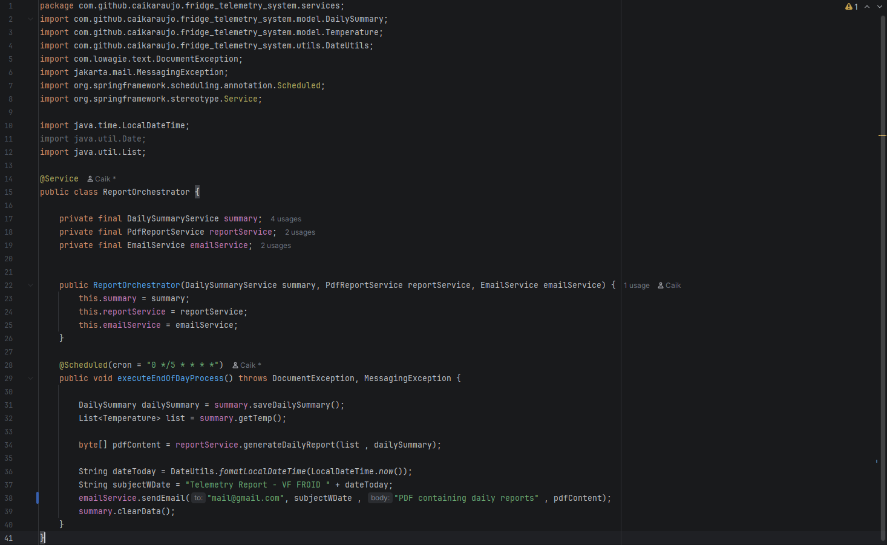
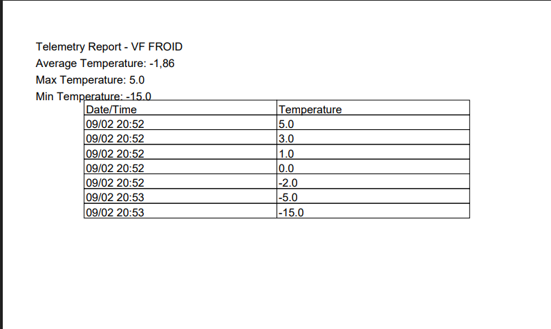
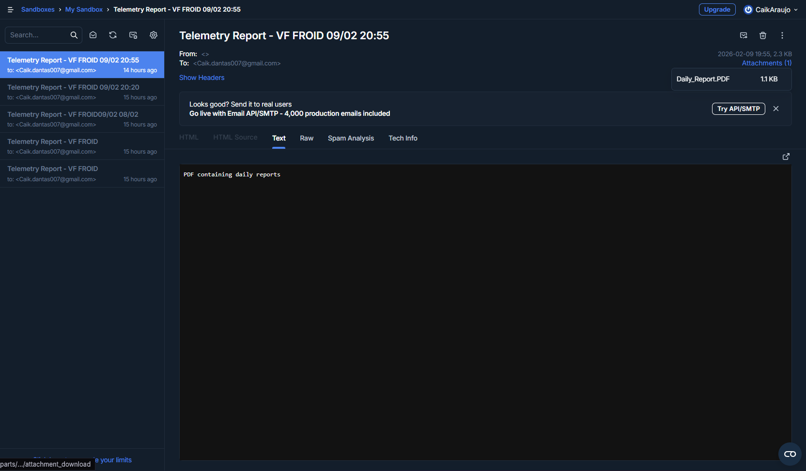

# 🧊 Fridge Telemetry System — VF FROID

This project was developed to provide a real-world solution for industrial thermal monitoring. The system automates the entire cycle of data collection, processing, and delivery for **VF FROID**.

## 🚀 Project Overview
The core objective was to eliminate manual processes and ensure the accuracy of temperature data. The system was built to be resilient and autonomous:

* **Reliability**: Uses a robust database structure to ensure no data point is lost.
* **Transparency**: Clients receive a consolidated report without needing to access the system manually.
* **Localization**: Operating in **Geneva**, the system is configured with the `Europe/Zurich` timezone for total precision in collection logs.

---

## 🏗️ Architecture & Technical Decisions

### 1. Data Collection & Persistence
I implemented **Spring Data JPA** with **MySQL** to manage temperature readings efficiently.

> **Configuration Structure:**
> 

### 2. Orchestration & Scheduling
The "heart" of the system is the `ReportOrchestrator`, which utilizes `@Scheduled` with **Cron** expressions to trigger the end-of-day process exactly at 23:58.

> **Scheduler Code:**
> 

### 3. Report Generation (PDF)
I chose the **OpenPDF** library to craft professional documents. The main technical challenge was transforming raw data into readable statistics like Average, Maximum, and Minimum.

> **Final PDF Report:**
> 

### 4. Automated Delivery (Email)
Integrated **Jakarta Mail** with **Mailtrap** to securely validate email delivery with attachments, ensuring the client receives the correct PDF file.

> **Inbox Notification:**
> 

---

## 🛠️ Tech Stack
* **Java 21** & **Spring Boot 3**.
* **Maven** for dependency management.
* **OpenPDF** for document manipulation.
* **Mailtrap** for SMTP testing.

---

## 🔮 Roadmap (Future Updates)
The software is designed to evolve. Next steps include:

* **Custom Exceptions**: Implementing a business exception hierarchy (e.g., `ReportDeliveryException`) for professional error handling.
* **Dashboards**: Implementing a Next.js interface for real-time visualization beyond the PDF.
* **Security**: Adding JWT authentication for the collection API.

---

## 🔧 How to Run
1. Rename `src/main/resources/application.properties.example` to `application.properties`.
2. Fill in your MySQL and SMTP credentials.
3. Run `./mvnw spring-boot:run`.

---
Developed by **Caik Araujo** — *Software Engineering student at Unicesumar*.